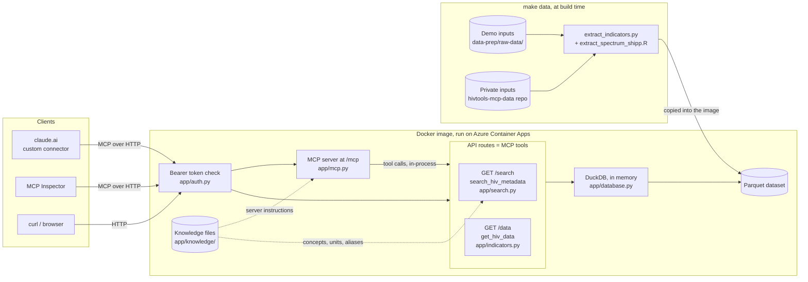
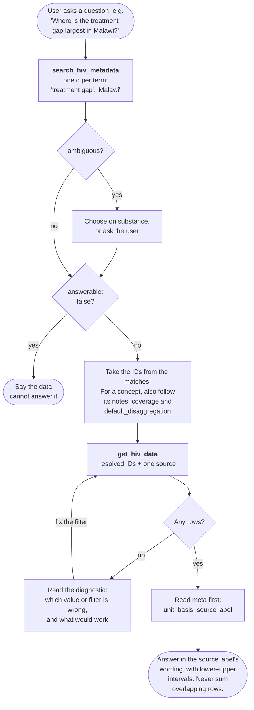

# hivtools-mcp

[](https://img.shields.io/github/v/release/hivtools/hivtools-mcp)
[](https://github.com/hivtools/hivtools-mcp/actions/workflows/main.yml?query=branch%3Amain)
[](https://codecov.io/gh/hivtools/hivtools-mcp)
[](https://img.shields.io/github/commit-activity/m/hivtools/hivtools-mcp)
[](https://img.shields.io/github/license/hivtools/hivtools-mcp)

An HTTP API and [MCP](https://modelcontextprotocol.io) server that lets an LLM,
such as Claude through a claude.ai custom connector, answer questions using
modelled HIV estimates from Naomi, Spectrum and SHIPP. It gives the model two
tools: `search_hiv_metadata` turns plain-language terms into IDs, and
`get_hiv_data` returns the estimates for those IDs.

- **GitHub repository**: <https://github.com/hivtools/hivtools-mcp/>
- **Documentation**: <https://hivtools.github.io/hivtools-mcp/>

**Contents:** [How it works](#how-it-works) ·
[Running locally](#running-locally) ·
[Testing the MCP server locally](#testing-the-mcp-server-locally) ·
[Deploying](#deploying) ·
[Further documentation](#further-documentation)

## How it works

### Architecture



- **One app, two interfaces.** [`app/main.py`](app/main.py) is a FastAPI app.
  [`app/mcp.py`](app/mcp.py) generates the MCP server from that app's OpenAPI
  schema, so each route is also a tool. A route's docstring is the tool
  description the model reads.
- **The data is built ahead of time.** `make data` turns the model outputs into
  a Parquet dataset, which is copied into the Docker image. Nothing is fetched at
  runtime, so shipping new data means cutting a new release.
- **Hand-written knowledge.** [`app/knowledge/`](app/knowledge/) holds the facts
  the model outputs don't include: concepts such as "treatment gap", units, age
  groups that are safe to sum, and the server instructions.
- **One bearer token** protects both the API and `/mcp`. Locally no token is set,
  so everything is open.

### How an LLM uses the tools



The model can't guess IDs (the treatment gap is `untreated_plhiv_num`), so it
always searches first. The tool descriptions in [`app/search.py`](app/search.py)
and [`app/indicators.py`](app/indicators.py) steer it through this flow, and so do
the server instructions in
[`app/knowledge/instructions.md`](app/knowledge/instructions.md). Not every MCP
client loads server instructions, so anything the model must know goes in the
tool descriptions as well.

## Running locally

### Requirements

| Tool | Needed for |
| --- | --- |
| [uv](https://docs.astral.sh/uv/getting-started/installation/) | Everything. It installs Python (3.10+) and the dependencies. |
| Git | Cloning the repos |
| [Node.js](https://nodejs.org/) 22.19+ | [Testing with the MCP Inspector](#testing-the-mcp-server-locally) (`npx`) |
| Docker | *Optional:* building and running the image |
| R | *Optional:* building the Spectrum and SHIPP files in the private data |
| Access to [hivtools-mcp-data](https://github.com/hivtools/hivtools-mcp-data) | *Optional:* the private data. Ask a maintainer. |

### One-time setup

```bash
git clone git@github.com:hivtools/hivtools-mcp.git
cd hivtools-mcp
make install   # creates .venv with uv and installs the pre-commit hooks
make data      # builds the public demo dataset into data-prep/naomi-data/
```

Without `make data` the server still starts, but every query returns no rows.

**Optional: private data.** The data that isn't public lives in the private
[hivtools-mcp-data](https://github.com/hivtools/hivtools-mcp-data) repo. You clone
it into this repo (the folder is gitignored):

```bash
git clone git@github.com:hivtools/hivtools-mcp-data.git data-prep/private-data
make r-deps   # the R packages that read Spectrum and SHIPP files
make data     # now builds the demo data and the private data
```

> [!WARNING]
> This repo is public. Never commit private inputs or anything built from them,
> and never print them in CI logs.

With the private data checked out, `make test` also checks the knowledge files
against it. [docs/data.md](docs/data.md) covers how the dataset is built and how to
update the private data.

### Running the server

```bash
make dev
```

This serves the app at <http://127.0.0.1:8000> and reloads when you change a file.

| URL | What it is |
| --- | --- |
| <http://127.0.0.1:8000/docs> | Interactive API docs |
| <http://127.0.0.1:8000/mcp> | The MCP server (streamable HTTP) |
| <http://127.0.0.1:8000/search?q=Lilongwe&country=MWI> | An example search |

Every MCP tool call is logged in this terminal, with its arguments and the start
of the response.

To switch auth on, as in production, set a token:
`HIVTOOLS_MCP_API_TOKEN=some-token make dev`. Settings are environment variables,
or can go in a `.env` file. See [Configuration](docs/api.md#configuration) for the
full list.

### Running the tests and checks

```bash
make test    # pytest, with coverage
make check   # lock file, pre-commit (ruff), ty type check, deptry
```

CI runs both, and runs the tests on Python 3.10 to 3.14. `make help` lists every
target.

### Running with Docker

```bash
docker build -t hivtools-mcp .   # public demo data only
make docker                      # the dataset `make data` builds, private data included
docker run -p 80:80 -e HIVTOOLS_MCP_API_TOKEN=some-token hivtools-mcp
```

The app is then at <http://127.0.0.1:80>. The image refuses to start without a
token, because its data may not be public. For a throwaway local run, add
`-e HIVTOOLS_MCP_REQUIRE_AUTH=false`. For how data gets into the image, see
[docs/data.md](docs/data.md#how-data-gets-into-the-docker-image).

## Testing the MCP server locally

Use the [MCP Inspector](https://github.com/modelcontextprotocol/inspector), which
needs Node.js 22.19 or later.

1. Start the server: `make dev`.
1. In another terminal, start the Inspector. It opens in your browser.
   ```bash
   npx @modelcontextprotocol/inspector
   ```
1. Add the server: click **Add Servers → Add manually**. Choose the
   **streamable-http** transport and enter the URL `http://localhost:8000/mcp`.
   If you set `HIVTOOLS_MCP_API_TOKEN`, add the header
   `Authorization: Bearer <token>`. Click **Add**.
1. Switch the server's toggle on to connect, then open **Tools**. You should see
   **Search Hiv Metadata** (`search_hiv_metadata`) and **Get Hiv Data**
   (`get_hiv_data`).
1. Pick a tool, fill in its arguments and click **Execute Tool**. Arguments must
   be valid JSON, so put quotes around strings (`"MWI"`) and write lists like
   `["Lilongwe"]`.

To see what the model sees, follow [the flow above](#how-an-llm-uses-the-tools)
with the demo data:

1. `search_hiv_metadata` with `q` = `["treatment gap", "Lilongwe"]` and
   `country` = `"MWI"`. The first result for each term is a concept or an area
   with its ID.
1. `get_hiv_data` with those IDs, for example `indicator` =
   `["untreated_plhiv_num"]` and `area_id` = `["MWI_3_13_demo"]`.
1. Try a wrong ID, such as `area_id` = `["Lilongwe"]`, to see the `diagnostic`.

### From the command line

The Inspector also has a CLI mode, which is handy for quick checks:

```bash
# List the tools
npx @modelcontextprotocol/inspector --cli http://127.0.0.1:8000/mcp --method tools/list

# Call a tool
npx @modelcontextprotocol/inspector --cli http://127.0.0.1:8000/mcp \
  --method tools/call --tool-name search_hiv_metadata \
  --tool-arg 'q=["Lilongwe"]' --tool-arg country=MWI
```

If auth is on, add `--header "Authorization: Bearer <token>"`.

## Deploying

Production runs on Azure Container Apps. Publishing a GitHub Release deploys it,
and there are no manual steps.

**What you need:** write access to this repo, so you can merge to `main` and
publish releases. You don't need Azure access to release, only to
[change the infrastructure](#changing-the-infrastructure).

### Releasing a new version

1. In your PR, bump `version` in `pyproject.toml`:
   ```bash
   uv version --bump patch   # or minor / major; also updates uv.lock
   ```
1. Merge the PR to `main`.
1. Publish a GitHub Release. Its tag is the new version with a `v` in front.
   You can do this in the GitHub UI (**Releases → Draft a new release**) or with:
   ```bash
   gh release create v0.3.1 --target main --generate-notes
   ```
1. Watch the **release-main** workflow in the Actions tab, or with `gh run watch`.

The release runs
[`.github/workflows/on-release-main.yml`](.github/workflows/on-release-main.yml),
which:

1. Fails fast if the tag doesn't match the version in `pyproject.toml`.
1. Checks out the private data repo and builds the dataset with `make data`.
1. Builds the image and pushes it to Azure Container Registry, tagged `vX.Y.Z`.
1. Rolls a new Container Apps revision onto that image.
1. Smoke-tests the new revision: it checks the health and version endpoints, that
   `/data` refuses requests without the token, and that each source is served.
1. Publishes the documentation site to GitHub Pages.

To check it afterwards, the workflow run's summary page links to the live app
(the `production` environment). `https://<that host>/version` should return the
new version.

### Shipping new data

The data is built into the image, so new data also ships as a release:

1. Push the data change to hivtools-mcp-data. See
   [Updating the private data](docs/data.md#updating-it).
1. Bump the version and publish a release, as above. A release tag can only be
   used once, so a data-only release still needs a version bump.

The release builds from the data repo's default branch, or from the
`DATA_REPO_REF` variable if it is set on the `production` environment. The image
registry is private, but anyone who can pull the image can read the data.

### Changing the infrastructure

The Azure resources are managed with Terraform in [`infra/`](infra/). CI only
validates it. Someone applies it by hand, which needs Azure access and the local
state file. [`infra/README.md`](infra/README.md) covers this, plus the one-time
setup: provisioning, the GitHub variables and secrets the release needs, and
rotating the API token.

## Further documentation

- [docs/data.md](docs/data.md): the data sources, `datasets.yaml`, the private
  data repo, how the Parquet dataset is built, and how it gets into the image.
- [docs/api.md](docs/api.md): HTTP API reference for `/search` and `/data`,
  authentication, and every configuration setting.
- [infra/README.md](infra/README.md): the Azure infrastructure and one-time
  deployment setup.
- [app/knowledge/](app/knowledge/): the hand-written knowledge files the tools
  serve.
- [CONTRIBUTING.md](CONTRIBUTING.md): how to contribute.
