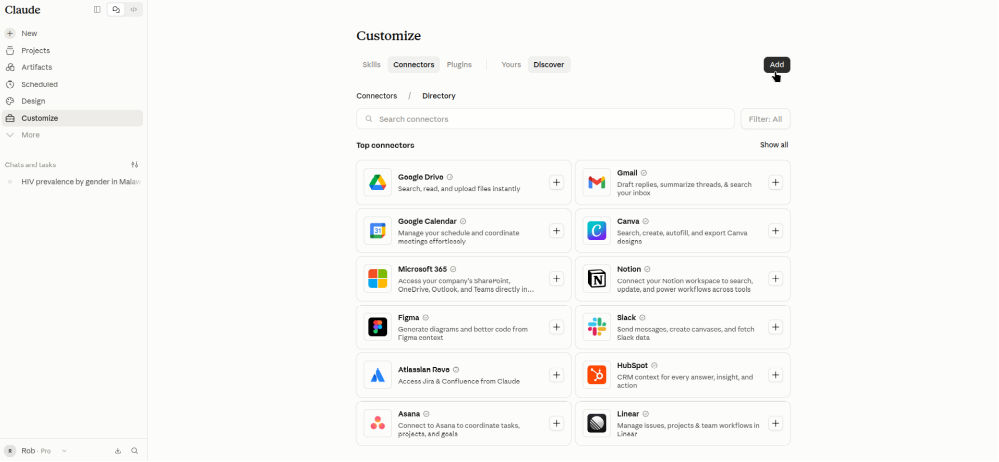
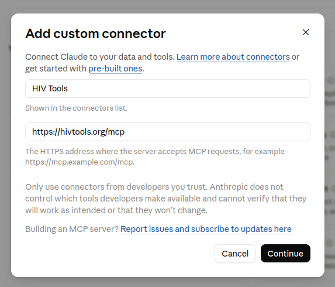
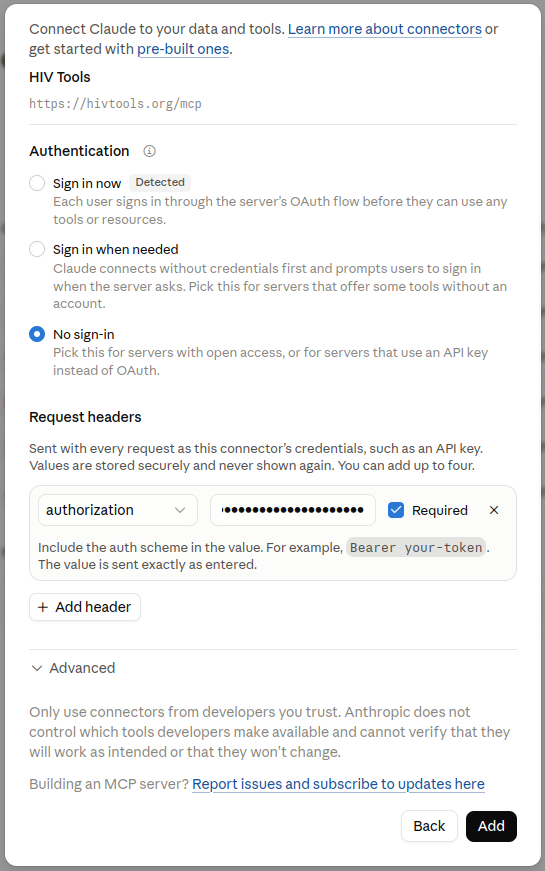

# hivtools-mcp

API and MCP server for hivtools data

# Adding MCP server to Claude

1. Go to [Claude](https://claude.ai) and log in
1. Click on "Customize" on the left-hand side
1. Select "Connectors" and click "Add"

    

1. Set the "Name" to "HIV Tools" and the "MCP server URL" to "https://hivtools.org/mcp" and click "Continue"

    

1. Under "Authentication" set it to "No sign-in". You can ignore the warning that is raised.
1. Add a "Request header" with key "authorization" and value given to you by Rob or Rachel. Ensure the token contains the scheme e.g. "Bearer <token>" and ensure "Required" button is selected. Scroll to the bottom and click "Add".

    

1. Click "Connect"
1. You should see a list of tools "Get HIV Data" and "Search HIV Metadata". Give your AI approval to use these tools by changing the drop-down from "Needs approval" to "Always allow".
1. You can now start a chat and use the tools
